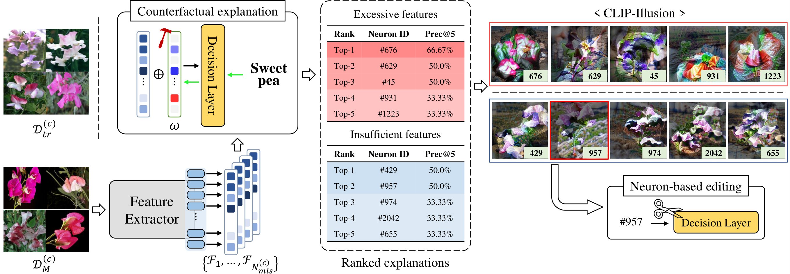

## Neuron-based Debugging Framework for Neural Networks Using Class-conditional Visualizations

> [Yeong-Joon Ju](https://github.com/yeongjoonJu), Ji-Hoon Park, and Seong-Whan Lee

## Abstract

Despite deep learning (DL) has achieved remarkable progress in various domains, the DL models are still prone to making mistakes. This issue necessitates effective debugging tools for DL practitioners to interpret the decision-making process within the networks. However, existing debugging methods often demand extra data or adjustments to the decision process, limiting their applicability. To tackle this problem, we present NeuroInspect, an interpretable neuron-based debugging framework with three key stages: counterfactual explanations, feature visualizations, and false correlation mitigation. Our debugging framework first pinpoints neurons responsible for mistakes in the network and then visualizes features embedded in the neurons to be human-interpretable. To provide these explanations, we introduce CLIP-Illusion, a novel feature visualization method that generates images representing features conditioned on classes to examine the connection between neurons and the decision layer. We alleviate convoluted explanations of the conventional visualization approach by employing class information, thereby isolating mixed properties. This process offers more human-interpretable explanations for model errors without altering the trained network or requiring additional data. Furthermore, our framework mitigates false correlations learned from a dataset under a stochastic perspective, modifying decisions for the neurons considered as the main causes. We validate the effectiveness of our framework by addressing false correlations and improving inferences for classes with the worst performance in real-world settings. Moreover, we demonstrate that NeuroInspect helps debug the mistakes of DL models through evaluation for human understanding.

 **Overall process of our debugging framework**

## Settings
Our code was implemented in Ubuntu OS.

**Library**
~~~
torch==1.12.1
timm==0.6.12
pillow
tqdm
open_clip_torch
~~~

## Quick start

This repo supports models in the timm libary.

**Debugging your classifier for a specific class**

if you want to get visualizations with more good quality or activations, increase `iters` to 450.

~~~bash
python -m scripts.debug_mistakes_per_class --model [architecture_name] --dataset [dataset_name] --ckpt_path [mode_checkpoint_path] --domain [defined_class_library] --class_idx [target_class_index] --domain_eps 0.05 --class_gamma 0.5
~~~~

## Mitigating spurious correlation (Object recognition)

### Flowers102 Dataset (ResNet-50)

**Training Settings:**
| Hyperparameter | Batch size | LR   | Epochs              | Scheduler         | Optimizer | Weight decay |
| -------------- | ---------- | ---- | --------------------| ----------------- | --------- | ------------ |
| Standard       | 128        | 2e-3 | 30                  | cosine (min 1e-4) | Adam      | 0.0          |
| Editing (- FC) | 128        | 1e-3 | 20 (patience: 5)    | warmup            | Adam      | 0.0          |

Command:
~~~bash
# Training
python train_test_classifier.py --model resnet50 --dataset flowers102 --batch_size 128 --lr 2e-3 --eta_min_lr 1e-4 --optim adam --num_epochs 20 --device [device_id] --download_data

# Testing
python train_test_classifier.py --model resnet50 --dataset flowers102 --batch_size 64 --test_only --ckpt_path ckpt/flowers102_resnet50/best_model.pt --device [device_id]
~~~

Debugging Command:

~~~bash
python -m scripts.debug_mistakes_per_class --model resnet50 --dataset flowers102 --ckpt_path ckpt/flowers102_resnet50/best_model.pt --domain flowers --class_idx 3 --class_gamma 0.5 --domain_eps 0.05
~~~

**Editing Options**
+ $o$: 1.003
+ $\lambda_3$: 0.01
+ Target neurons: 901, 1480, 1201

Editing Command:

~~~bash
python -m scripts.edit_decision --model resnet50 --dataset flowers102 --ckpt_path ckpt/flowers102_resnet50/best_model.pt --modifying_class 93 --batch_size 128 --lr 1e-3 --lambda3 1e-2 --neurons 901 1480 1201 --gamma 1.003 --device 0
~~~

**Results**
| Results    | Test Acc    | Class Acc (Class 3) |
| ---------- | ----------- | ------------------- |
| Original   | 84.66%      | 33.33%     |
| After Edit | 84.26%      | 58.33%     |

___

### Food101 Dataset (ResNet-50)

**Training Settings:**
| Hyperparameter | Batch size | LR   | Epochs              | Scheduler         | Optimizer | Weight decay |
| -------------- | ---------- | ---- | ------------------- | ----------------- | --------- | ------------ |
| Standard       | 128        | 2e-3 | 30                  | cosine (min 1e-4) | Adam      | 0.0          |
| Editing (- FC) | 128        | 1e-3 | 20 (patience: 5)    | warmup            | Adam      | 0.0          |

Command:
~~~bash
# Training
python train_test_classifier.py --model resnet50 --dataset food101 --batch_size 128 --lr 2e-3 --eta_min_lr 1e-4 --optim adam --num_epochs 30 --device [device_id] --download_data

# Testing
python train_test_classifier.py --model resnet50 --dataset food101 --batch_size 64 --test_only --ckpt_path ckpt/food101_resnet50/best_model.pt --device [device_id]
~~~

Debugging Command:

~~~bash
# Debugging
python -m scripts.debug_mistakes_per_class --model resnet50 --dataset food101 --ckpt_path ckpt/food101_resnet50/best_model.pt --domain food --class_idx 93 --class_gamma 0.45 --domain_eps 0.05 --device [device_id]
~~~

**Editing Options**
+ $o$: 1.02
+ $\lambda_3$: 0.01
+ Target neurons: 1039, 1172, 1549

Editing Command:

~~~bash
python -m scripts.edit_decision --model resnet50 --dataset food101 --ckpt_path ckpt/food101_resnet50/best_model.pt --modifying_class 93 --batch_size 128 --lr 1e-3 --lambda3 1e-2 --neurons 1039 1172 1549 --gamma 1.02 --device [device_id]
~~~

**Results**
| Results    | Test Acc  | Class Acc (Class 93) |
| ---------- | --------- | -------------------- |
| Original   | 82.65%    | 43.2%                |
| After Edit | 82.20%    | 58.0%                |

___

### Waterbird Dataset (ResNet-50)

**Training Settings:**
| Hyperparameter | Batch size | LR   | Epochs              | Scheduler         | Optimizer | Weight decay |
| -------------- | ---------- | ---- | ------------------- | ----------------- | --------- | ------------ |
| Standard       | 32         | 1e-4 | 50                  | None              | Adam      | 1e-4         |
| Editing (- FC) | 32         | 5e-5 | 20 (patience: 5)    | None              | Adam      | 1e-4         |

Command:
~~~bash
# Training
python train_test_classifier.py --model resnet50 --dataset waterbird --batch_size 32 --lr 1e-4 --eta_min_lr 1e-4 --optim adam --num_epochs 50 --weight_decay 1e-4 --device [device_id]

# Testing
python train_test_classifier.py --model resnet50 --dataset waterbird --batch_size 64 --test_only --ckpt_path ckpt/waterbird_resnet50/best_model.pt --device [device_id]
~~~

Debugging Command:

~~~bash
# Debugging
python -m scripts.debug_mistakes_per_class --model resnet50 --dataset waterbird --ckpt_path ckpt/waterbird_resnet50/best_model.pt --domain waterbird --class_idx 1 --class_gamma 0.5 --domain_eps 0.05 --device [device_id]
~~~

**Editing Options**
+ $o$: 1.0
+ $\lambda_3$: 0.01
+ Target neurons: 6, 915, 1493, 1039, 341, 623

Editing Command:

~~~bash
# Debugging
python -m scripts.edit_decision_waterbird --model resnet50 --dataset waterbird --ckpt_path ckpt/waterbird_resnet50/best_model.pt --class_idx 1 --class_gamma 0.5 --domain_eps 0.05 --device [device_id]
~~~

**Results**
| Results    | Test Acc  | Worst class Acc  | Worst group Acc  |
| ---------- | --------- | ---------------- | ---------------- |
| Original   | 91.73%    | 79.83% (class 1) | 66.04% |
| After Edit | 90.65%    | 83.88% (class 1) | 72.43% |

___

### MetaShift Experiments

**Set experiments for spurious correlations**

First, please obtain the Metashift using instructions in the [Metashift Repository](https://github.com/Weixin-Liang/MetaShift/).
Next, please change `METASHIFT_ROOT` in exp_spurious/constant.py to your PATH.

~~~bash
cd exp_spurious
git clone https://github.com/Weixin-Liang/MetaShift.git
wget -c https://nlp.stanford.edu/data/gqa/images.zip
unzip images.zip -d allImages
~~~

Training and debugging the models
~~~bash
cd exp_spurious
bash run_train_debug.sh
~~~

Editing the model after identifying neurons corresponding to spurious features
~~~bash
cd exp_spurious
bash run_editing.sh
~~~