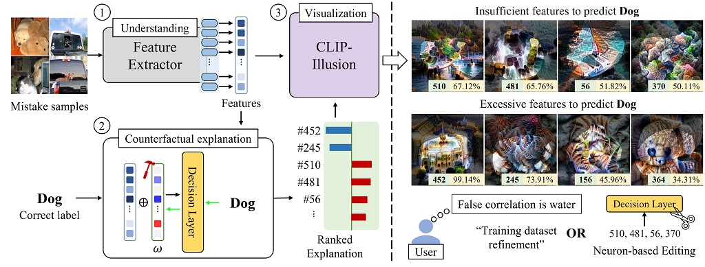

## Neuron-based Debugging Framework for Neural Networks Using Class-conditional Visualizations
 
 ## Abstract

 Interpreting the decision-making process of deep neural networks without additional data or retraining is challenging due to their black-box nature. Neuron interpretation approaches offer a solution, but abstruse visualizations or confirmation bias hinder the adoption of interpreted neurons as supporting evidence for decisions. This paper presents a neuron-based debugging framework based on the perspective that neurons represent sets of human-understandable concepts. To explain the underlying reasons for decisions, we introduce CLIP-Illusion, a novel feature visualization method that generates images representing features conditioned on classes to examine the connection between neurons and the decision layer. We mitigate convoluted explanations by leveraging class-conditional visualization with class information, isolating mixed properties. Our simple debugging framework reveals and alleviates the causes of the mistakes in image classification networks through counterfactual explanations by interpreting concepts of features through human-understandable visualizations. We validate the effectiveness of our framework by addressing false correlations learned from the dataset and improving inferences for hard classes in real-world settings.

 **Overall process of our debugging framework**

## Settings
Our code was implemented in Ubuntu OS.

**Library**
~~~
torch==1.12.1
timm==0.6.12
pillow
tqdm
open_clip_torch
~~~

## Quick start

This repo supports models in the timm libary.

**Debugging your classifier for a specific class**

if you want to get visualizations with more good quality or activations, increase `iters` to 450.

~~~bash
python -m scripts.debug_mistakes_per_class --model [architecture_name] --dataset [dataset_name] --ckpt_path [mode_checkpoint_path] --domain [defined_class_library] --class_idx [target_class_index] --domain_eps 0.1 --class_gamma 0.65
~~~~

## Mitigating spurious correlation (Object recognition)

### Flowers102 Dataset (ResNet-50)

**Training Settings:**
| Hyperparameter | Batch size | LR   | Epochs              | Scheduler         | Optimizer | Weight decay |
| -------------- | ---------- | ---- | --------------------| ----------------- | --------- | ------------ |
| Standard       | 128        | 2e-3 | 20                  | cosine (min 1e-4) | Adam      | 0.0          |
| Editing (- FC) | 128        | 1e-4 | 20 (patience: 3)    | warmup            | Adam      | 1e-4         |

Command:
~~~bash
# Training
python train_test_classifier.py --model resnet50 --dataset flowers102 --batch_size 128 --lr 2e-3 --eta_min_lr 1e-4 --optim adam --num_epochs 20 --device [device_id] --download_data

# Testing
python train_test_classifier.py --model resnet50 --dataset flowers102 --batch_size 128 --test_only --ckpt_path ckpt/flowers102_resnet50/best_model.pt --device [device_id]
~~~

**Editing Options**
+ $o$: 1.0035 (auto)
+ $\lambda_3$: 0.1
+ Target neurons (auto): 1480
    > Threshold: 0.95, domain epsilon: 0.1, class gamma: 0.65, batch size: 4 (mean)

Command:

Please input "auto" when you select neurons

~~~bash
# Debugging
python -m scripts.debug_mistakes_per_class --model resnet50 --dataset flowers102 --ckpt_path ckpt/flowers102_resnet50/best_model.pt --domain flowers --class_idx 3 --class_gamma 0.65 --domain_eps 0.1
~~~

**Results**
| Results    | Val Acc | Test Acc    | Worst class Acc      |
| ---------- | ------- | ----------- | -------------------- |
| Original   | 89.411% | 84.16%      | 33.33% (class 3)     |
| After Edit | 89.216% | **84.241%** | **41.67%** (class 3) |

### Food101 Dataset (ResNet-50)

**Training Settings:**
| Hyperparameter | Batch size | LR   | Epochs              | Scheduler         | Optimizer | Weight decay |
| -------------- | ---------- | ---- | ------------------- | ----------------- | --------- | ------------ |
| Standard       | 128        | 2e-3 | 20                  | cosine (min 1e-4) | Adam      | 0.0          |
| Editing (- FC) | 128        | 1e-4 | 20 (patience: 3)    | warmup            | Adam      | 1e-4         |

Command:
~~~bash
# Training
python train_test_classifier.py --model resnet50 --dataset food101 --batch_size 128 --lr 2e-3 --eta_min_lr 1e-4 --optim adam --num_epochs 20 --device [device_id] --download_data

# Testing
python train_test_classifier.py --model resnet50 --dataset food101 --batch_size 128 --test_only --ckpt_path ckpt/food101_resnet50/best_model.pt --device [device_id]
~~~

**Editing Options**
+ $o$: 1.0142 (auto)
+ $\lambda_3$: 0.1
+ Target neurons (auto): 853, 1372, 1022, 563, 661, 2039, 514, 1511
    > Threshold: 0.95, domain epsilon: 0.1, class gamma: 0.65, batch size: 4 (mean)

Command:

Please input "auto" when you select neurons

~~~bash
# Debugging
python -m scripts.debug_mistakes_per_class --model resnet50 --dataset food101 --ckpt_path ckpt/food101_resnet50/best_model.pt --domain food --class_idx 93 --class_gamma 0.6 --domain_eps 0.1
~~~

**Results**
| Results    | Val Acc    | Test Acc    | Worst class Acc      |
| ---------- | ---------- | ----------- | -------------------- |
| Original   | 79.43%     | 83.51%      | 57.2% (class 93)     |
| After Edit | **79.56%** | **83.66%** | **56.4%** (class 77) / 60.4% (class 93)|

### Waterbird Dataset (ResNet-50)

**Training Settings:**
| Hyperparameter | Batch size | LR   | Epochs              | Scheduler         | Optimizer | Weight decay |
| -------------- | ---------- | ---- | ------------------- | ----------------- | --------- | ------------ |
| Standard       | 128        | 2e-3 | 20                  | cosine (min 1e-4) | Adam      | 0.0          |
| Editing (- FC) | 128        | 1e-4 | 20 (patience: 3)    | warmup            | Adam      | 1e-4         |

Command:
~~~bash
# Training
python train_test_classifier.py --model resnet50 --dataset waterbird --batch_size 32 --lr 1e-3 --eta_min_lr 1e-3 --optim adam --num_epochs 300 --weight_decay 1e-4 --device [device_id] --download_data

# Testing
python train_test_classifier.py --model resnet50 --dataset food101 --batch_size 128 --test_only --ckpt_path ckpt/food101_resnet50/best_model.pt --device [device_id]
~~~

**Editing Options**
+ $o$: 1.0142 (auto)
+ $\lambda_3$: 0.1
+ Target neurons (auto): 853, 1372, 1022, 563, 661, 2039, 514, 1511
    > Threshold: 0.95, domain epsilon: 0.1, class gamma: 0.65, batch size: 4 (mean)

Command:

Please input "auto" when you select neurons

~~~bash
# Debugging
python -m scripts.debug_mistakes_per_class --model resnet50 --dataset food101 --ckpt_path ckpt/food101_resnet50/best_model.pt --domain food --class_idx 93 --class_gamma 0.65 --domain_eps 0.05

python -m scripts.edit_decision --model resnet50 --dataset food101 --ckpt_path ckpt/food101_resnet50/best_model.pt --domain food --class_gamma 0.65 --domain_eps 0.1 --gamma 1.0 --neurons 853 1372 1022 563 661 2039 514 1511 --modifying_class 93
~~~

**Results**
| Results    | Val Acc    | Test Acc    | Worst class Acc      |
| ---------- | ---------- | ----------- | -------------------- |
| Original   | 79.43%     | 83.51%      | 57.2% (class 93)     |
| After Edit | **79.56%** | **83.66%** | **56.4%** (class 77) / 60.4% (class 93)|

**Set experiments for spurious correlations**

First, please obtain the Metashift using instructions in the [Metashift Repository](https://github.com/Weixin-Liang/MetaShift/).
Next, please change `METASHIFT_ROOT` in exp_spurious/constant.py to your PATH.

~~~bash
cd exp_spurious
git clone https://github.com/Weixin-Liang/MetaShift.git
wget -c https://nlp.stanford.edu/data/gqa/images.zip
unzip images.zip -d allImages
~~~

Training and debugging the models
~~~bash
cd exp_spurious
bash run_train_debug.sh
~~~

Editing the model after identifying neurons corresponding to spurious features
~~~bash
cd exp_spurious
bash run_editing.sh
~~~

### Salient ImageNet

~~~bash
curl -L https://umd.app.box.com/shared/static/eyji8leh2lemhbxovgny9ywc9is53ibr -o salient_imagenet_dataset.zip
unzip salient_imagenet_dataset
~~~

